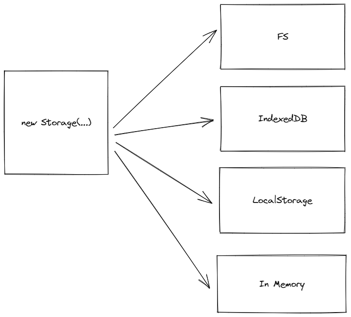

# An Isomorphic Storage SDK - Design

### **Requisites:**

- API for Storing data (Both server-side as well as Client-side).
- Models that act as abstractions on top of data APIs.
- Reactivity on operations for two-way sync.
- Capability for data migrations.

### **Implementation**

Different platforms/storage layers will be enabled via an adapter and the dependency injection + inversion approach will be used.



This ensures we only consume bundle sizes for what we need + scope operations to their environments, anything not imported will not be invoked and thus.

```tsx
// On Web
new Storage(new IndexedDBAdapter(...itsOwnOptionsOrConfig));  // Can work with 'idb' library
// On Node.js
new Storage(new FSAdapter()); // Can work with node:fs or fs-extra underneath
```

### ******API******

All APIs will be asynchronous to allow for operations even on the Cloud and long-open operations for certain adapters.

The API can be built on this Interface, each adapter has the ability to override/implement certain functions depending on their inbuilt capabilities.

Each data bit stored will have a `key` associated with it for identification and has to be provided by the user, consider it equivalent to a file name or path when we work with the native FS layer (Which this Storage SDK can also support).

```tsx
interface StorageAPI {
	find: (filters) => Promise<FoundRecord[]>,
	findOne: (filters) => Promise<FoundRecord | null>,
	create: (key: string, data: unknown) =>  Promise<boolean>,
	createMany: (entries: { key: string, data: unknown }[]) =>  Promise<{ inserted?: boolean, error?: Error }[]>,
	delete: (filters) =>  Promise<boolean>,
	deleteMany: (filters) =>  Promise<{ success?: void | error?: Error }[]>,
	updateOne: (filters, updates) =>  Promise<boolean>,
  ...
}

class IndexedDBAdapter implements StorageAPI {
   find (filters) {
      return idb.find(filters);  // Oversimplification, but you get the idea.
   }
   ...
}

// End-user consumption
storage = new Storage(new IndexedDBAdapter());

storage.find(filters);  // Storage.find -> IndexedDB.find -> Dependency Inverted low-level API.
```

Each adapter can put checks in place for the kind of data they can store as well as for operations that are not supported.

For example: Local storage isn’t great at storing complex data but IndexedDB is. KV Storage doesn’t hold relevance when you want `createMany`, you just `create` a `key-value` operation. In memory storage is good at everything but can’t keep a lot of data without hanging the user’s system.

> Side-note: These APIs can obviously be wrapped to return an `{ error, result }` value instead of throwing errors on op failures.
> 

### **********************With Models**********************

Models can act as one extra layer of abstraction on top of storage layers, giving two main benefits:

- Provide logical or actual layer-level separation for storage of entity-specific data.
- Provide constraints around the structure of data stored via Schemas.

A model could correspond to data stored for Restaurants and another could correspond to data stored for Orders.

For different sets of users, these models could be initialized for different storage layers. For example: For signed-in users, the model could use a Cloud Database Adapter where data is sent and stored in a Database using the Database’s ORMs whereas for a signed-out user, the data could be stored in IndexedDB till they sign in.

```tsx
// Builds on the structure Mongoose uses
const model = (collectionName: string, schema: ModelSchema, storageInstance: Storage) => {
	return class Model {
		constructor(newEntityData: Record<string, unknown>, key?: string) {
			const schemaViolations = validateDataWithSchema(schema, newEntityData);
			if (schemaViolations.length) {
				const error = new Error("Invalid structure of data");
				error.violations = schemaViolations;
				throw error;
			}

			// Create a new entity that can be saved, edited etc with getters and setters.
			const key = uuid();
			this.entity = { key, data: new Proxy(newEntityData, ...) };
		}

		save() {
			return storageInstance.create(this.entity.key, this.entity.data);
		}
			
		// ... All other functions exposed via the Storage SDK can be added as static class properties here.
	}
}
```

### Reactivity on Data operations for two-way sync

Most storage layers provide a way to listen for events on storage.

We could have a `Set` of listener functions using the publisher-subscriber model on our Storage class.

```tsx
class Storage {
	listeners: Record<supportedOps: string, Set<Function>>;

	constructor (adapter: IndexedDBAdapter | CloudAdapter | FSAdapter ...) {
		...
  }

	on(op: string, callback: Function) {
		this.listeners[op].add(callback);
	}

	off(op: string, callback:  Function) {
		this.listeners[op].remove(callback);
	}
}
```

The storage layer could then add a single listener for all supported operations on the Adapter Instance, and invoke all listeners associated with that op with the information received.

The Adapter instance could decide to trigger these operations as part of their API function implementations (Some storage layers do not support events and this can serve as a fallback) or rely on native events to format event data and pass it on to the Storage Class.

```tsx
// In constructor of storage class
for(const op of supportedOperations) {
	adapter.on(op, (event) => {
		const opListeners = Array.from(this.listeners[op]) || [];
		for(const listener of opListeners)
			listener(event);
	});
}

// Don't forget to unsubscribe in class destructor
```

### Capability for Data Migrations

A user can simply block their application UI (If they have any) and run a script to update data corresponding to models.

For **marking** migrations and versioning, some storage layers like IndexedDB provide ‘database versions’ which are increments to signify how many times a database schema has changed, this can be done on each migration or for storage layers that do not support them, we can simply have a different model to track the number/step of migrations.

Do note that a set of migration scripts always has to be maintained in the exact order in which they have been applied.

```tsx
// storage-data-migrations.js

const migrations = [
	(onComplete) => {
		//  1. Check if this migration function script has already been run, via DB version or a model made to track the number of migrations performed.
		//  2. If yes, skip this script by invoking `onComplete` and move to the next one.
		//  3. If not, run this function's logic and move to the next one by invoking `onComplete`.
	},
	(onComplete) => {
		// Do the same as above
	},
	...
]

executeInSeries(migrations);
```

### More

Feel free to add use cases and their descriptions or improve the existing by creating a PR on this repo.